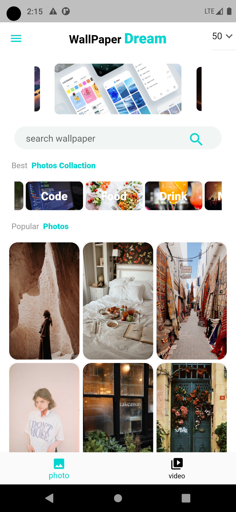

# Project Name
   ## Dream Wallpaper and Short Video Flutter Based Cross Platform Application
 this application can be help you to make your every day life easy and used every day new unlimeted Wallpaper photo for your mobile ,your computer and you can used any type of image you like for your other social media by search and download,you can also  used this app to view many short video every time released by simple search on your app

# The Technology this project used
  #### -> flutter 
  #### -> GetX for state management,routing management and dependency injection in flutter project
  #### -> used MVC(model view controle) framework to make simple code style in flutter
  #### -> used API for featching the image and video from internet
  ####  -> and used flutter package from pubdev  to integrete in to the project
 
# the full sample image of the application

   <h5>photo page sample </h5>
   
   <h5>single selected  photo sample </h5>
   
   <h5>list of image in collection </h5>
   
   <h5>Video page sample </h5>
   
   <h5>Video page display sample </h5>
   

# to get more information you  can contact me using the following email address or phone number
 
 <a href="mailto::awolabdulbaasit143@gmail.com">email -> awolabdulbaasit143@gmail.com</a> 
  
 phone -> +251911996750 
 thank's for every thing 
